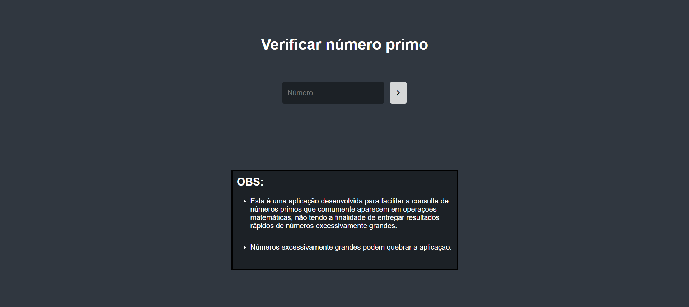

<h1 align="center">Verificador de número primo</h1>

  <a href="#-tecnologias">Tecnologias</a>&nbsp;&nbsp;&nbsp;|&nbsp;&nbsp;&nbsp;
  <a href="#-projeto">Projeto</a>

## Tecnologias

- HTML
- CSS
- JAVASCRIPT

## Projeto

O verificador de número primo foi desenvolvido a fim de gerar prática e portfólio a partir de uma demanda pessoal. Sou estudante inicial de Engenharia de Computação e ao realizar operações matemáticas que me retornavam uma raiz, determinados números me deixavam em dúvida se eram primos ou não, para saber se conseguiria fatorá-los.
Caso eu não quisesse ter o trabalho de testar até chegar em uma resposta, que ainda assim tinha a possibilidade de ser falha, eu tinha a opção de pesquisar no Google. Mas, tendo a opção de deixar essa aplicação aberta, em qualquer dispositivo, digitar o número e dar enter e obter o resultado, é bem mais prático.